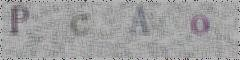

## Dataset Description
---
- Description

    At each stage, there are 50,000 images in each of the training and test sets. Each picture contains several characters **(English characters are case-sensitive)**, and the labels of the training dataset pictures are the **characters** arranged in the picture from left to right.

- Example:

    - Picture Name: ```00001.jpg```

    - Picture: 

    - Label:  ```PcAo```

- Prediction Results:

    The submitted result should be saved as a **JSON file** with all the pictures' id and the predicted characters.
    - Format: 
        ```
        [
            {
                "id": "00001.jpg",
                "characters": "PcAo"
            },
            ...
        ]

        ```

    - Name: ```prediction.json```
- Evaluation

    - Accuracy = number of correctly recognized pictures / total number of pictures 

## Download
---

### Training Dataset

<!-- - *[download link]()* -->
- *coming soon...*

### Validation Dataset

<!-- - *[download link]()* -->
- *coming soon...*
